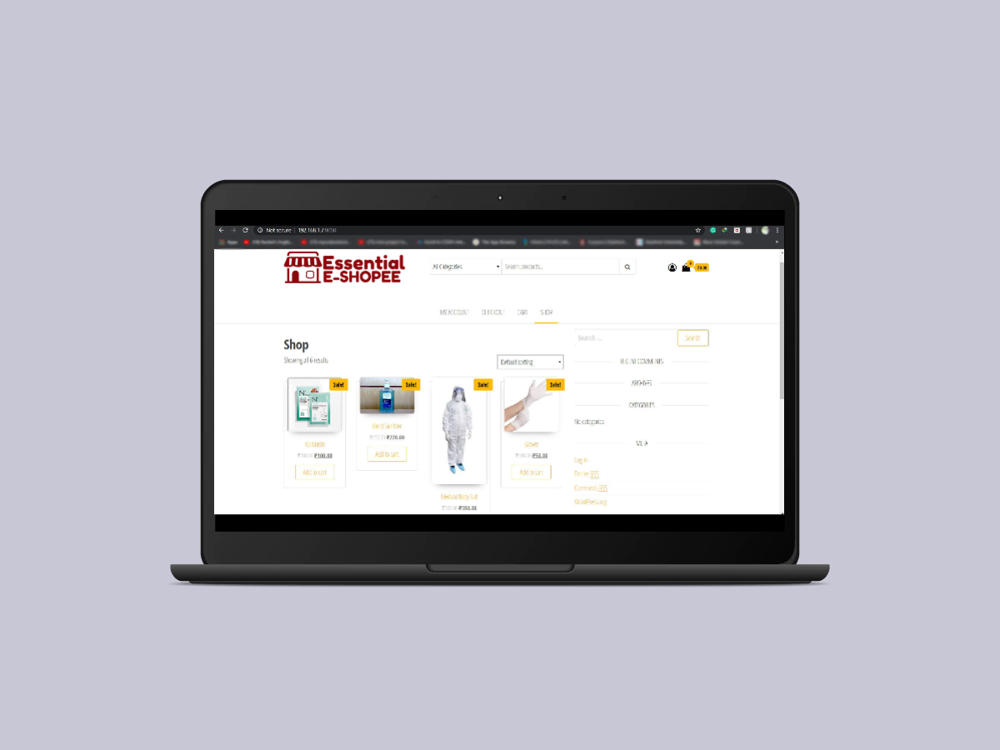
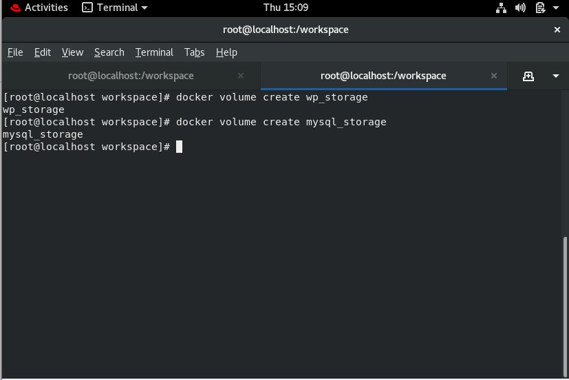
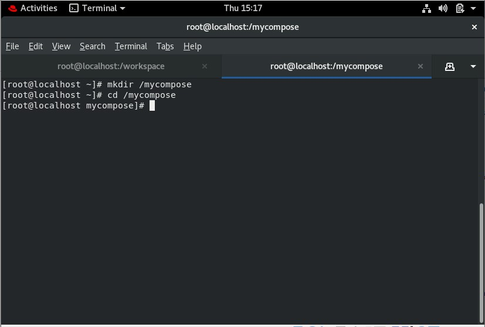
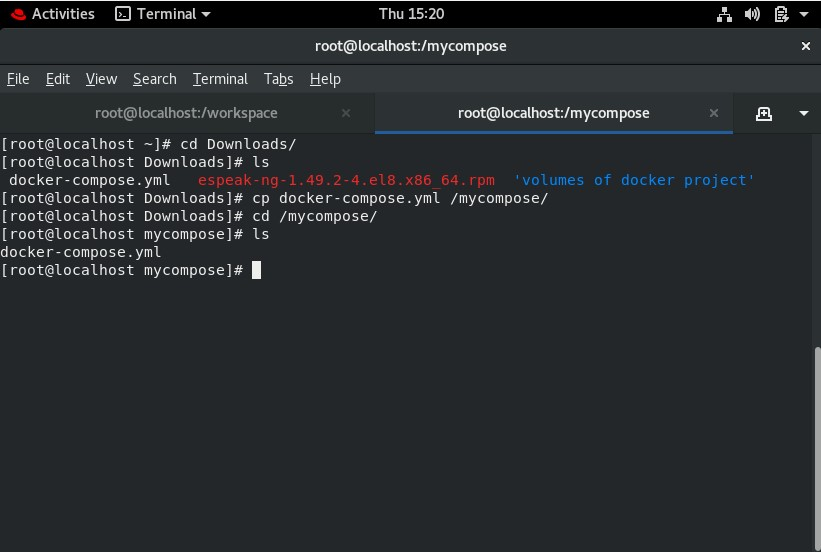
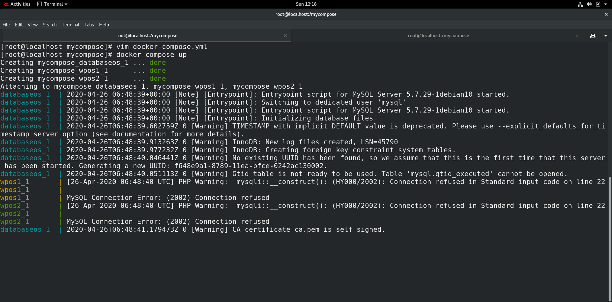
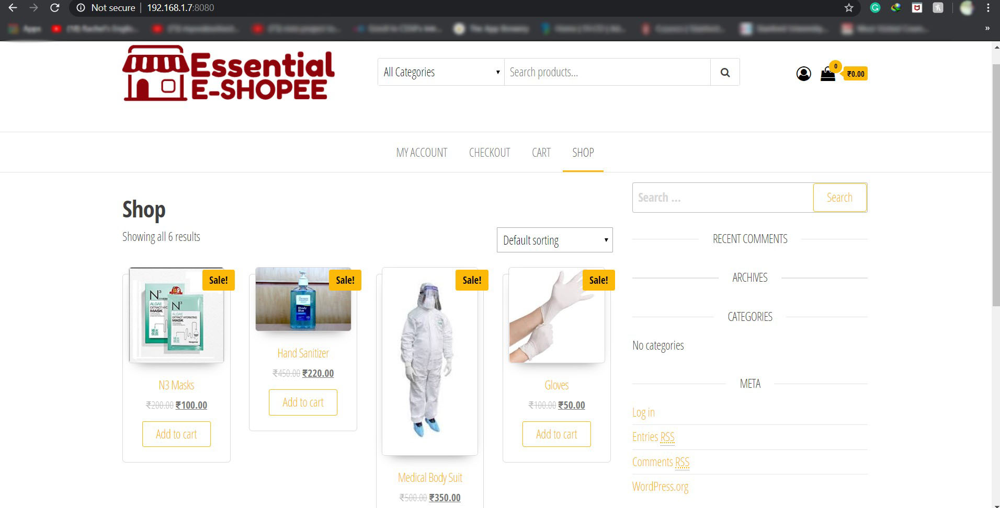

# Docker-Project 01
## Title: Online E-Commerce Website for supplying essential items needed during this lockdown.


@author: Muhammad Tabish
@github: https://github.com/mtabishk
@LinkedIN : https://www.linkedin.com/in/mtabishk/
```
Project Details:
This project is build using docker containers. It is aimed for supplying essential items like Masks, Gloves, Sanitizers, Body suits and any other essential item needed during lockdown.
```
```
In this project three containers are launched in which two containers are Wordpress containers running on port 8080 and 8081 for hosting our website, further both containers are linked by PAT to manage a load of customers using concept of load balancing. The third container is a mysql database for storing the essential information about the customers and the goods they buy.

The most important thing is to save data persistently in these containers in case the containers are crashed , for that I have mounted storage in docker for fixing this isuue. 
Now you can fell free about your data , It will be never lost.

Also an amazing thing about this project is that I have written all the code to build this project in a single docker compose yml file. I will help you to launch the project in 1 second, By only running a single command.
```
***Assumptions:
RedHat Linux 8 or Centos 8 running in a virtual box. Docker is installed and configured. Docker container images like centos8:, mysql:5.7, wordpress:5.1.1-php7.3-apache are already installed.
Docker Compose should be also installed.***

## STEPS:
1. Open Terminal

2. Create two volume using commands :



3.create directory /mycompose to store docker-compose yml file



4.Copy docker-compose.yml file given in this repository to /mycompose directory



5.Run command :



6. Check website using your browser: https://192.168.1.7:8080 (use your own ip of RedHat O.S)



## Thank you :)


